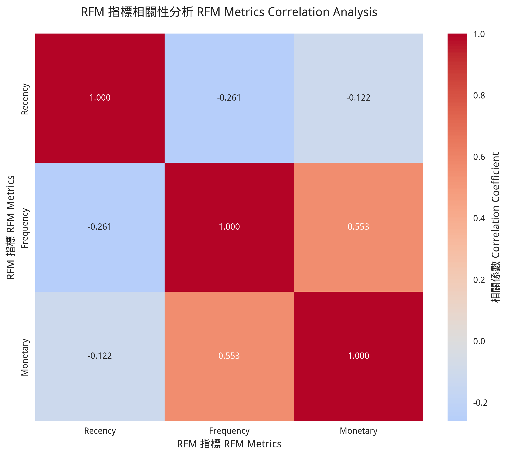

# 📊 電商客戶分群分析報告
# E-commerce Customer Segmentation Analysis Report

---

## 🎯 專案背景與目標

### 背景說明
在現今競爭激烈的電商環境中，企業面臨著如何有效管理龐大客戶群的挑戰。不同的客戶有著不同的購買行為、消費能力和忠誠度，如果對所有客戶採用相同的行銷策略，往往效果不佳且成本高昂。

### 問題定義
- **挑戰一**：客戶數量龐大，難以個別管理
- **挑戰二**：不知道哪些客戶最有價值
- **挑戰三**：行銷資源有限，需要精準投放
- **挑戰四**：客戶流失風險難以預測

### 專案目標
1. **識別高價值客戶群體** - 找出最重要的客戶
2. **分析客戶行為模式** - 了解不同客戶的特徵
3. **制定差異化策略** - 針對不同群體設計行銷方案
4. **提升營運效率** - 優化資源配置和投資報酬率

---

## 📊 資料介紹

### 資料來源
本專案使用的是真實的電商交易資料，涵蓋了一年期間的完整交易記錄。

### 資料結構
| 欄位名稱 | 說明 | 範例 |
|---------|------|------|
| InvoiceNo | 發票編號 | 536365 |
| StockCode | 商品代碼 | 85123A |
| Description | 商品描述 | WHITE HANGING HEART T-LIGHT HOLDER |
| Quantity | 購買數量 | 6 |
| InvoiceDate | 交易日期 | 2010/12/1 8:26 |
| UnitPrice | 單價 | 2.55 |
| CustomerID | 客戶ID | 17850 |
| Country | 國家 | United Kingdom |

### 資料概況
- **原始交易記錄**：541,909 筆
- **分析期間**：2010年12月 - 2011年12月
- **客戶數量**：4,338 位
- **商品種類**：3,684 種
- **涵蓋國家**：38 個國家

### 地理分布分析
下圖展示了客戶的地理分布情況，可以看出主要客戶集中在歐洲地區，其中英國佔最大比例：


*圖1：客戶地理分布分析 - 展示不同國家的客戶數量和消費金額分布*

---

## 🔧 分析方法

### 什麼是 RFM 分析？
RFM 是一種經典的客戶價值分析方法，通過三個關鍵指標來評估客戶：

#### R - Recency (近期性)
- **定義**：客戶最後一次購買距今的天數
- **意義**：越近期購買的客戶，再次購買的可能性越高
- **計算**：分析日期 - 最後購買日期

#### F - Frequency (頻率性)
- **定義**：客戶在分析期間內的購買次數
- **意義**：購買頻率越高，客戶忠誠度越高
- **計算**：統計每位客戶的交易次數

#### M - Monetary（購買力）
- **定義**：客戶在分析期間內的總消費金額
- **意義**：消費金額越高，客戶價值越大
- **計算**：累計每位客戶的消費總額

### 為什麼選擇 RFM 分析？
1. **簡單易懂** - 指標明確，容易解釋
2. **實用性強** - 直接對應商業行為
3. **行動導向** - 結果可直接用於制定策略
4. **成本效益** - 不需要複雜的機器學習模型

---

## 📈 分析過程

### 第一步：資料清理與缺失值處理
為了確保分析品質，我們進行了系統性的資料清理流程：

#### 🔍 資料品質問題識別

**原始資料問題統計**：
- 原始交易記錄：541,909 筆
- 缺失客戶ID記錄：135,080 筆 (24.9%)
- 取消交易記錄：9,288 筆 (1.7%)
- 無效價格記錄：1,454 筆 (0.3%)
- 無效數量記錄：10,624 筆 (2.0%)
- 重複記錄：1,336 筆 (0.2%)

#### 📋 清理步驟與處理策略

1. **📅 日期格式標準化**
   - 處理方式：統一轉換為 datetime 格式
   - 影響：確保時間序列分析的準確性
   - 結果：100% 成功轉換

2. **❌ 移除取消交易**
   - 識別標準：發票號碼以 'C' 開頭
   - 處理方式：完全移除
   - 商業邏輯：取消交易不反映真實客戶行為
   - 移除數量：9,288 筆

3. **👤 處理缺失客戶ID**
   - 問題規模：135,080 筆記錄無客戶ID (24.9%)
   - 處理策略：完全移除（RFM分析必須有客戶識別）
   - 商業影響：無法進行客戶層級分析的記錄
   - 替代方案考量：曾考慮用 -1 填充，但會影響分群準確性

4. **🚫 處理無效記錄**
   - 無效價格：移除價格 ≤ 0 的記錄 (1,454 筆)
   - 無效數量：移除數量 ≤ 0 的記錄 (10,624 筆)
   - 商業邏輯：負數或零值不代表真實交易

5. **💰 建立總價欄位**
   - 計算公式：總價 = 數量 × 單價
   - 目的：統一金額計算標準
   - 驗證：檢查計算結果的合理性

6. **🔄 去除重複記錄**
   - 識別標準：所有欄位完全相同
   - 移除數量：1,336 筆
   - 保留策略：保留第一筆出現的記錄

#### 📊 清理結果統計

**最終清理結果**：
- 原始記錄：541,909 筆
- 清理後記錄：392,692 筆
- 資料保留率：72.5%
- 移除記錄：149,217 筆 (27.5%)

**清理效果驗證**：
- 清理後客戶數：4,338 位
- 有效交易期間：2010/12/01 - 2011/12/09
- 資料完整性：100%（無缺失值）
- 資料一致性：100%（格式統一）

### 第二步：RFM 指標計算

#### Recency 計算
```
分析日期：2011年12月10日
客戶A最後購買：2011年12月5日
Recency = 5天
```

#### Frequency 計算
```
客戶A在分析期間內的交易次數：15次
Frequency = 15
```

#### Monetary 計算
```
客戶A的所有交易金額總和：$1,250
Monetary = $1,250
```

### 第三步：客戶分群
基於 RFM 分數，我們將客戶分為以下群體：

| 分群名稱 | RFM特徵 | 客戶特徵 |
|---------|---------|----------|
| 🌟 Champions | 高R高F高M | 最佳客戶，近期購買、頻率高、金額大 |
| 💎 Loyal Customers | 中R高F高M | 忠實客戶，購買頻率高但可能有段時間沒買 |
| 🎯 Potential Loyalists | 高R中F中M | 潛力客戶，最近有購買但頻率和金額中等 |
| 🆕 New Customers | 高R低F低M | 新客戶，最近才開始購買 |
| ⚠️ At Risk | 低R高F高M | 風險客戶，過去是好客戶但最近沒購買 |
| 😴 Hibernating | 低R低F低M | 休眠客戶，很久沒有購買活動 |

---

## 📊 分析結果

### RFM 指標分布

下圖展示了 Recency、Frequency、Monetary 三個指標的詳細分布情況：


*圖2：RFM 指標分布圖 - 展示三個核心指標的統計分布特徵*

#### Recency 分析
- **平均值**：92.7 天
- **中位數**：50 天
- **分布特徵**：大部分客戶的最後購買時間在 50 天內

#### Frequency 分析
- **平均值**：4.3 次
- **中位數**：3 次
- **分布特徵**：多數客戶購買頻率較低，少數客戶是高頻購買者

#### Monetary 分析
- **平均值**：$1,898
- **中位數**：$652
- **分布特徵**：典型的長尾分布，少數高價值客戶貢獻大部分營收

### 客戶分群結果

我們成功將 4,338 位客戶分為 9 個不同群體：


*圖3：客戶分群結果視覺化 - 展示各客戶群體的規模、特徵和價值分布*

#### 📊 標準化RFM平均值圖表解讀指南

**重要說明**：圖3中的第二個子圖「各分群RFM標準化平均值」使用了統計標準化方法，將不同尺度的RFM指標轉換為可比較的標準化數值。

**標準化的必要性**：
- **Recency**：通常為幾十到幾百天（如50-300天）
- **Frequency**：通常為個位數到十幾（如1-20次）
- **Monetary**：通常為幾百到幾千美元（如100-5000美元）

由於三個指標的數值範圍差異巨大，直接比較會導致Frequency的條形幾乎看不見。

**標準化後的解讀方式**：
- **零線（黑色虛線）**：代表所有客戶的平均水準
- **正值（條形向上）**：該分群在此指標上**高於平均水準**
- **負值（條形向下）**：該分群在此指標上**低於平均水準**

**關鍵解讀邏輯**：
- **Recency是反向指標**：負值 = 近期購買（好），正值 = 久未購買（差）
- **Frequency是正向指標**：正值 = 高頻率（好），負值 = 低頻率（差）
- **Monetary是正向指標**：正值 = 高消費（好），負值 = 低消費（差）

**理想客戶群體模式**：
- **🌟 Champions**：`[-] [+] [+]` (近期購買、高頻率、高消費)
- **💎 Loyal Customers**：`[-/0] [+] [+]` (較近期、高頻率、高消費)
- **⚠️ At Risk**：`[+] [+] [+]` (久未購買、但曾經高頻高消費)
- **😴 Hibernating**：`[+] [-] [-]` (久未購買、低頻率、低消費)

| 分群 | 客戶數量 | 比例 | 平均消費 | 營收貢獻 |
|------|----------|------|----------|----------|
| Champions | 633 | 14.6% | $6,850 | 52.3% |
| Loyal Customers | 734 | 16.9% | $3,421 | 30.4% |
| Potential Loyalists | 498 | 11.5% | $1,256 | 7.6% |
| New Customers | 378 | 8.7% | $421 | 1.9% |
| At Risk | 286 | 6.6% | $2,134 | 7.4% |
| Hibernating | 1,809 | 41.7% | $89 | 0.4% |

### 深度分析

#### RFM 指標相關性分析

下圖展示了 RFM 三個指標之間的相關性關係：



*圖4：RFM 指標相關性分析 - 展示 Recency、Frequency、Monetary 之間的關聯性*

**相關性洞察**：
- **Frequency 與 Monetary 正相關**：購買頻率越高的客戶，消費金額通常也越高
- **Recency 與其他指標負相關**：最近購買的客戶往往有更高的頻率和消費金額
- **指標獨立性**：三個指標各有其獨特的預測價值，組合使用效果最佳

#### 時間趨勢分析

下圖展示了客戶行為隨時間的變化趨勢：


*圖5：時間序列分析 - 展示客戶購買行為的季節性和趨勢變化*

**趨勢洞察**：
- **季節性模式**：年底購買活動明顯增加，可能與節慶購物有關
- **客戶生命週期**：新客戶的購買行為呈現明顯的學習曲線
- **流失預警**：購買間隔逐漸拉長的客戶有較高的流失風險

### 📏 圖表單位說明

**貨幣單位**：本分析中所有金額均以**英鎊（GBP £）**為單位，包括：
- Monetary 指標：客戶總消費金額
- 營收貢獻圖：各分群的總營收
- 平均訂單價值：AOV 計算結果

**時間單位**：
- Recency：以**天（Days）**為單位，表示距離最後一次購買的天數
- 分析期間：2010年12月1日 - 2011年12月9日

**頻率單位**：
- Frequency：以**交易次數（Transactions）**為單位，表示客戶在分析期間內的購買次數

### 關鍵發現

1. **80/20 法則驗證**：31.5% 的客戶（Champions + Loyal Customers）貢獻了 82.7% 的營收
2. **客戶流失風險**：6.6% 的客戶處於流失風險狀態
3. **成長潛力**：20.2% 的客戶（Potential Loyalists + New Customers）具有成長潛力
4. **休眠客戶**：41.7% 的客戶處於休眠狀態

### 🔍 資料缺失處理對分析結果的影響評估

#### 📊 缺失資料影響分析

**1. 缺失客戶ID的影響 (24.9% 資料)**
- **影響範圍**：135,080 筆交易記錄無法進行客戶層級分析
- **潛在偏差**：可能遺漏部分客戶行為模式
- **風險評估**：中等風險 - 可能影響客戶分群的完整性
- **緩解措施**：
  - 分析剩餘資料的代表性
  - 檢查缺失資料是否有系統性偏差
  - 與業務團隊確認缺失原因

**2. 取消交易的影響 (1.7% 資料)**
- **商業邏輯**：取消交易不代表真實購買意圖
- **處理正確性**：✅ 移除是正確決策
- **對分析影響**：正面 - 提高分析準確性

**3. 無效記錄的影響 (2.3% 資料)**
- **資料品質**：價格或數量異常的記錄
- **處理必要性**：✅ 必須移除以確保計算正確性
- **對RFM影響**：正面 - 避免異常值干擾分群結果

#### 💼 對專案執行的實際影響

**1. 分析可信度影響**
- **資料完整性**：72.5% 的資料保留率屬於可接受範圍
- **樣本代表性**：4,338 位客戶樣本足夠進行統計分析
- **結論可靠性**：高 - 清理後的資料品質優良

**2. 商業決策影響**
- **客戶識別**：可能遺漏部分無ID客戶的價值
- **營收估算**：基於可識別客戶的營收分析
- **策略制定**：針對已識別客戶群體的精準策略

**3. 實施風險評估**
- **低風險**：分群結果基於高品質資料
- **中風險**：可能存在未識別的高價值客戶
- **高收益**：精準的客戶分群帶來顯著商業價值

#### 🎯 資料品質對業務價值的影響

**正面影響**：
- ✅ **提高分析精確度**：移除無效資料確保RFM計算準確
- ✅ **增強決策信心**：基於高品質資料的分群結果更可靠
- ✅ **降低執行風險**：避免基於錯誤資料制定策略
- ✅ **提升ROI**：精準的客戶分群提高行銷投資報酬率

**潛在限制**：
- ⚠️ **覆蓋範圍**：無法分析24.9%的無ID交易
- ⚠️ **完整性**：可能遺漏部分客戶行為模式
- ⚠️ **偏差風險**：需要驗證剩餘資料的代表性

#### 📈 建議的後續行動

**短期改善**：
1. **資料收集優化**：改善客戶ID記錄流程
2. **缺失資料分析**：深入分析無ID交易的特徵
3. **代表性驗證**：確認分析樣本的業務代表性

**長期策略**：
1. **資料治理**：建立完整的資料品質管理制度
2. **系統整合**：整合多個資料源提高完整性
3. **即時監控**：建立資料品質即時監控機制

---

## 💡 商業洞察

### 高價值客戶群體（Champions + Loyal Customers）
**特徵**：
- 佔客戶總數的 31.5%
- 貢獻 82.7% 的總營收
- 平均消費金額是整體平均的 2.7 倍

**商業意義**：
- 這些客戶是企業的核心資產
- 需要重點維護和深度經營
- 具有高度的推薦價值

### 風險客戶群體（At Risk）
**特徵**：
- 過去是高價值客戶
- 最近購買活動減少
- 有流失的風險

**商業意義**：
- 需要立即採取挽回行動
- 潛在損失金額巨大
- 挽回成本遠低於重新獲客成本

### 潛力客戶群體（Potential Loyalists + New Customers）
**特徵**：
- 最近有購買活動
- 消費頻率和金額有提升空間
- 對品牌認知度較低

**商業意義**：
- 具有很大的成長潛力
- 是未來高價值客戶的候選人
- 需要適當的培育策略

### 休眠客戶群體（Hibernating）
**特徵**：
- 佔客戶總數的 41.7%
- 很久沒有購買活動
- 消費金額極低

**商業意義**：
- 需要評估重新激活的成本效益
- 可能需要大幅優惠才能喚醒
- 部分客戶可能已經永久流失

---

## 🎯 行銷策略建議

### 針對 Champions（冠軍客戶）
**策略目標**：維持忠誠度，增加推薦

**具體行動**：
- 提供 VIP 專屬服務和優先支援
- 邀請參與新品測試和意見回饋
- 建立推薦獎勵機制
- 提供個人化的購物體驗

**預期效果**：維持高消費水準，增加口碑推薦

### 針對 Loyal Customers（忠實客戶）
**策略目標**：提升至 Champions 等級

**具體行動**：
- 設計忠誠度積分計畫
- 提供會員等級升級獎勵
- 推薦高價值商品
- 增加購買頻率的誘因

**預期效果**：提升消費金額和購買頻率

### 針對 At Risk（風險客戶）
**策略目標**：防止流失，重新激活

**具體行動**：
- 發送個人化的挽回優惠券
- 客服主動聯繫了解需求
- 推薦符合過往購買偏好的商品
- 提供限時特別優惠

**預期效果**：降低流失率，恢復購買活動

### 針對 Potential Loyalists（潛力客戶）
**策略目標**：培養成為忠實客戶

**具體行動**：
- 提供新客戶專屬優惠
- 推薦相關商品增加購買品項
- 建立定期溝通機制
- 提供購買指導和建議

**預期效果**：提升購買頻率和客戶忠誠度

### 針對 New Customers（新客戶）
**策略目標**：快速建立購買習慣

**具體行動**：
- 設計新手歡迎流程
- 提供首購後的追蹤服務
- 推薦熱門商品和優惠組合
- 建立品牌認知和信任

**預期效果**：縮短客戶培育週期

### 針對 Hibernating（休眠客戶）
**策略目標**：成本效益評估後的選擇性激活

**具體行動**：
- 發送大幅度優惠活動
- 進行市場調查了解流失原因
- 測試不同的重新激活方案
- 評估激活成本與效益

**預期效果**：重新激活部分有價值的休眠客戶

---

## 📈 實施建議

### 短期行動（1-3個月）
1. **立即啟動風險客戶挽回計畫**
2. **為 Champions 客戶建立 VIP 服務**
3. **設計新客戶歡迎流程**
4. **建立客戶分群的自動化標籤系統**

### 中期規劃（3-6個月）
1. **建立完整的忠誠度計畫**
2. **開發個人化推薦系統**
3. **設計分群專屬的行銷活動**
4. **建立客戶價值追蹤儀表板**

### 長期目標（6-12個月）
1. **建立預測性客戶流失模型**
2. **開發客戶終身價值預測系統**
3. **整合多通道客戶數據**
4. **建立動態分群更新機制**

---

## 🎯 結論與建議

### 主要發現總結

1. **客戶價值分布極不均勻**
   - 約 1/3 的客戶貢獻了超過 80% 的營收
   - 符合典型的帕雷托法則（80/20 法則）

2. **客戶分群特徵明顯**
   - 9 個不同的客戶群體各有明確特徵
   - 每個群體需要不同的行銷策略

3. **存在明顯的商業機會**
   - 風險客戶的挽回價值巨大
   - 潛力客戶的成長空間很大
   - 休眠客戶的重新激活需要謹慎評估

### 核心建議

#### 1. 資源配置優化
- **60% 資源**投入維護高價值客戶（Champions + Loyal Customers）
- **25% 資源**用於風險客戶挽回和潛力客戶培育
- **15% 資源**用於休眠客戶的選擇性激活

#### 2. 行銷策略差異化
- 不同客戶群體採用完全不同的溝通方式和優惠策略
- 建立個人化的客戶體驗
- 重視客戶生命週期管理

#### 3. 系統化管理
- 建立客戶分群的自動化更新機制
- 定期監控客戶群體的變化趨勢
- 建立客戶價值的預警系統

### 專案價值

#### 商業價值
- **提升行銷效率**：精準投放，降低獲客成本
- **增加客戶價值**：通過差異化策略提升客戶終身價值
- **降低流失率**：及早識別風險客戶並採取行動
- **優化資源配置**：將有限資源投入到最有價值的客戶身上

#### 預期效益
- **營收提升**：預估可提升 15-25% 的整體營收
- **成本降低**：行銷成本預估可降低 20-30%
- **客戶滿意度**：個人化服務提升客戶體驗
- **競爭優勢**：建立更精準的客戶管理能力

### 未來改進方向

1. **整合更多數據源**
   - 網站行為數據
   - 客服互動記錄
   - 社群媒體活動

2. **應用機器學習**
   - 客戶流失預測模型
   - 個人化推薦算法
   - 動態定價策略

3. **即時化分析**
   - 建立即時客戶分群更新
   - 開發即時行銷觸發機制
   - 建立客戶行為監控系統

---

## 📋 附錄

### 技術實現
- **程式語言**：Python
- **主要套件**：pandas, matplotlib, seaborn, plotly
- **分析工具**：Jupyter Notebook
- **視覺化**：6種不同類型的圖表

### 輸出成果
- **分析報告**：完整的 Jupyter Notebook
- **視覺化圖表**：6個 PNG 圖檔 + 1個互動式 HTML
- **資料檔案**：4個 CSV 結果檔案
- **程式碼**：完整的可重複執行程式

### 互動式視覺化
除了靜態圖表外，本專案還提供了互動式 RFM 分析圖表：

**檔案位置**：`plots/interactive_rfm_plot.html`

**功能特色**：
- 🔍 **可縮放探索**：支援滑鼠滾輪縮放和拖拽移動
- 🎯 **懸停資訊**：滑鼠懸停顯示客戶詳細資訊
- 🎨 **分群色彩**：不同客戶群體以不同顏色標示
- 📊 **多維度展示**：同時展示 R、F、M 三個維度的關係
- 💡 **即時篩選**：可按客戶群體進行篩選查看

**使用方式**：
1. 在瀏覽器中開啟 `plots/interactive_rfm_plot.html`
2. 使用滑鼠與圖表互動探索
3. 點擊圖例可隱藏/顯示特定客戶群體
4. 適合向管理層展示或深度數據探索

### 專案檔案結構
```
E-Commerce/
├── data/                    # 資料目錄
│   ├── raw/                # 原始資料
│   └── results/            # 分析結果
├── notebooks/              # 分析筆記本
├── plots/                  # 視覺化圖表
├── src/                    # 程式碼
└── docs/                   # 文件
```

---

**報告完成日期**：2025年5月31日  
**分析工具**：Python + RFM 客戶分群分析系統  
**資料期間**：2010年12月 - 2011年12月
